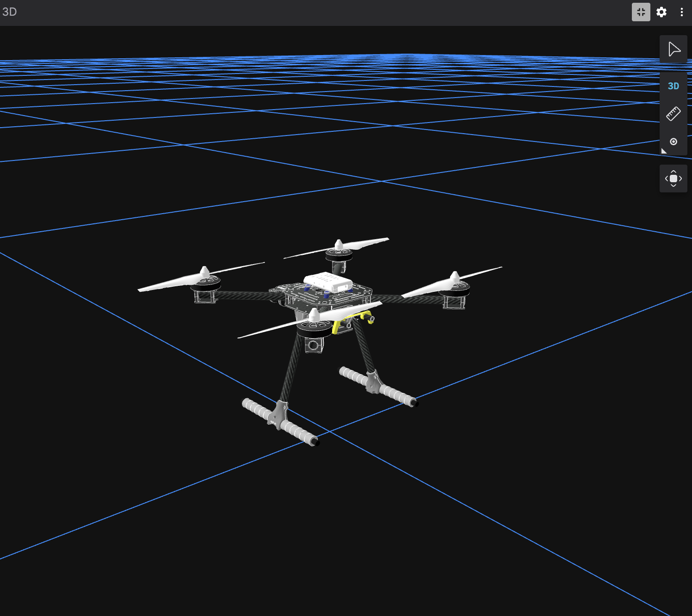

# DRN Stack

Dockerized PX4 v1.17 SITL, Gazebo Harmonic, ROS 2 Humble, and Foxglove visualization for the x500 quadrotor.



The formal architecture, implementation phases, and acceptance criteria are in
[`docs/DOCKER_PLAN.md`](docs/DOCKER_PLAN.md).

## Quick start

### Windows PowerShell

Start Docker Desktop with the Linux container engine, then run:

```powershell
.\scripts\run-sim.ps1
```

### Bash, Git Bash, or WSL

```bash
bash ./scripts/run-sim.sh
```

The first run builds PX4, Gazebo, the Micro XRCE-DDS Agent, and the ROS workspace, so it can take a while. Later runs use Docker's build cache and redeploy only changed images.

When the readiness checks pass:

- Foxglove: `ws://localhost:8765`
- QGroundControl: UDP `localhost:14550`
- PX4 odometry: `/fmu/out/vehicle_odometry`
- Drone transform: `map -> base_link`

Gazebo runs headless. Use Foxglove on the host for 3D visualization.

## Commands

| Action | PowerShell | Bash |
| --- | --- | --- |
| Build/redeploy and start | `.\scripts\run-sim.ps1` | `bash ./scripts/run-sim.sh` |
| Show health and topic status | `.\scripts\status.ps1` | `bash ./scripts/status.sh` |
| Follow all logs | `.\scripts\logs.ps1` | `bash ./scripts/logs.sh` |
| Follow PX4 logs | `.\scripts\logs.ps1 -Service px4-sitl` | `bash ./scripts/logs.sh px4-sitl` |
| Restart without rebuilding | `.\scripts\restart.ps1` | `bash ./scripts/restart.sh` |
| Stop and preserve images/cache | `.\scripts\stop.ps1` | `bash ./scripts/stop.sh` |
| Remove this stack's images/state | `.\scripts\clean.ps1 -Force` | `bash ./scripts/clean.sh --yes` |

Normal stop and redeploy operations do not delete Docker images or build caches. Cleanup is deliberately explicit and affects only the `drn-stack` Compose project.

## Architecture

The stack uses two services:

1. `ros-viz` runs ROS 2, Micro XRCE-DDS Agent, `drn_viz`, robot state publisher, and Foxglove Bridge.
2. `px4-sitl` runs PX4 and Gazebo Harmonic in headless mode.

The PX4 service shares the ROS service's network namespace. This preserves PX4 SITL's standard XRCE connection to `localhost:8888` without depending on cross-container DDS discovery.

Pinned upstream revisions:

- PX4-Autopilot `v1.17.0`
- `px4_msgs` `v1.17.0`
- `px4_ros_com` commit `86e9aeb20e55a4673fa8a9f1c29ea06a6c5ad1af`
- Micro XRCE-DDS Agent `v2.4.3`
- ROS 2 Humble on Ubuntu 22.04

## Configuration

The defaults work without creating an environment file. Copy `.env.example` to `.env` only when overrides are needed:

```dotenv
PX4_SIM_MODEL=gz_x500
PX4_GZ_WORLD=default
PX4_SIM_SPEED_FACTOR=1
ROS_DOMAIN_ID=0
FOXGLOVE_PORT=8765
QGC_PORT=14550
```

The convenience scripts read the same environment variables.

## Foxglove

1. Open Foxglove on the host.
2. Add a Foxglove WebSocket connection to `ws://localhost:8765`.
3. Add a 3D panel.
4. Use `map` as the fixed frame.
5. Add the Robot Model layer from `/robot_description`.

The ROS bridge publishes an identity `map -> base_link` transform until the first PX4 odometry message arrives.

## Troubleshooting

### Docker is unavailable

Start Docker Desktop and ensure it is using Linux containers:

```powershell
docker info
docker context show
```

### Startup fails

```powershell
.\scripts\status.ps1
.\scripts\logs.ps1
```

`run-sim` automatically prints the last 100 log lines when a build, health check, ROS topic check, or TF check fails.

### Port conflict

Override the host ports before starting:

```powershell
$env:FOXGLOVE_PORT = "18765"
$env:QGC_PORT = "14551"
.\scripts\run-sim.ps1
```

### Force a clean project rebuild

```powershell
.\scripts\clean.ps1 -Force
.\scripts\run-sim.ps1
```

This does not remove unrelated Docker images or the global Docker build cache.

## Development

`run-sim` always invokes a cached Compose build. Changes under `drn_viz/` invalidate only the relevant ROS image layers, rebuild the workspace, and recreate the changed service.

The project is currently monitoring-only. It subscribes to PX4 odometry and does not send commands to PX4.
